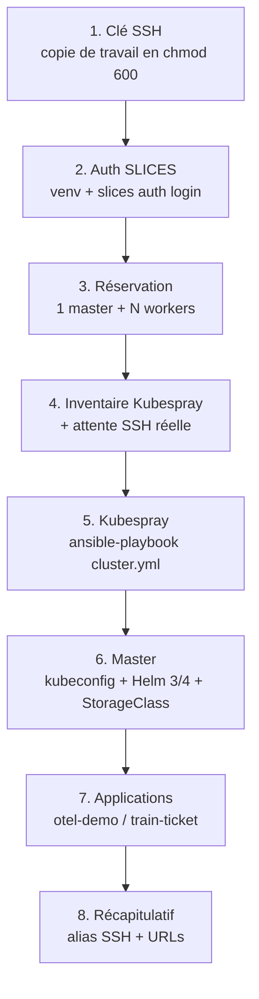

# autodeploy_k8s

> **Déploiement automatisé, reproductible et destructible d'un cluster Kubernetes
> sur l'infrastructure de recherche [SLICES-RI](https://slices-ri.eu/), puis d'une
> ou deux applications de microservices de référence.**

Une seule commande fait tout : réservation des machines virtuelles, installation
de Kubernetes avec Kubespray, préparation du stockage, déploiement des
applications, et affichage des URLs d'accès.

```bash
./deploy.sh --app both
```

| Application | Description | Services | Namespace |
|---|---|---|---|
| **OpenTelemetry Demo** | Boutique « Astronomy Shop », vitrine officielle de l'observabilité OpenTelemetry (traces, métriques, logs, Grafana, Jaeger, feature flags) | ~20 | `otel-demo` |
| **Train Ticket** | Benchmark académique de réservation de billets de train ([FudanSELab](https://github.com/FudanSELab/train-ticket)), très utilisé en recherche sur la détection d'anomalies et le *root cause analysis* | 41 | `train-ticket` |

---

## Sommaire

1. [Objectif et périmètre](#1-objectif-et-périmètre)
2. [Architecture](#2-architecture)
3. [Déroulé du déploiement](#3-déroulé-du-déploiement)
4. [Prérequis](#4-prérequis)
5. [Installation](#5-installation)
6. [Configuration : le fichier `.env`](#6-configuration--le-fichier-env)
7. [Utilisation](#7-utilisation)
8. [**Accès aux interfaces web**](#8-accès-aux-interfaces-web)
9. [Exploitation courante](#9-exploitation-courante)
10. [Dimensionnement et ressources](#10-dimensionnement-et-ressources)
11. [Destruction](#11-destruction)
12. [Dépannage](#12-dépannage)
13. [Structure du dépôt](#13-structure-du-dépôt)
14. [Choix d'implémentation](#14-choix-dimplémentation)
15. [Banc d'essai local](#15-banc-dessai-local)
16. [Références](#16-références)

---

## 1. Objectif et périmètre

Ce dépôt automatise la chaîne complète suivante :

1. **Réserver** des VMs sur un site SLICES-RI (par défaut `be-gent1-bi-vm1`, l'îlot
   *Bare-metal Infrastructure* d'imec à Gand) via la CLI officielle `slices bi`.
2. **Générer** dynamiquement un inventaire Ansible au format Kubespray à partir
   des adresses IP réellement attribuées.
3. **Installer** un cluster Kubernetes de production avec
   [Kubespray](https://github.com/kubernetes-sigs/kubespray) (1 nœud de contrôle
   + N nœuds de travail, etcd sur le master, CNI Calico par défaut).
4. **Préparer** le nœud master : `kubectl` pour l'utilisateur `ubuntu`, Helm 3
   **et** Helm 4, une `StorageClass` par défaut.
5. **Déployer** au choix OpenTelemetry Demo, Train Ticket, ou les deux, dans des
   namespaces séparés.
6. **Exposer** les interfaces web et afficher les URLs prêtes à l'emploi.
7. **Tout détruire** proprement en une commande, poste local compris.

Le tout est piloté depuis une machine **Ubuntu** — poste de travail, serveur, ou
machine virtuelle. Cette machine ne fait que piloter : elle n'exécute ni
Kubernetes, ni conteneur.

---

## 2. Architecture

```
   MACHINE DE PILOTAGE (Ubuntu)                     SLICES-RI — site be-gent1-bi-vm1
 ┌───────────────────────────────────┐          ┌──────────────────────────────────────────┐
 │  ./deploy.sh                      │          │                                          │
 │   ├── lib/common.sh   utilitaires │  CLI     │   ┌────────────────────────────────────┐ │
 │   ├── lib/slices.sh   ────────────┼─slices──▶│   │ master   (IPv4 publique)           │ │
 │   │      réservation + inventaire │   bi     │   │  • kube_control_plane + etcd       │ │
 │   ├── lib/cluster.sh  ────────────┼─Ansible─▶│   │  • kubectl, helm (v4), helm3       │ │
 │   │      Kubespray + bootstrap    │   SSH    │   │  • point d'entrée NodePort         │ │
 │   └── apps/*.sh       ────────────┼──SSH────▶│   └────────────────────────────────────┘ │
 │          copiés puis exécutés     │   scp    │   ┌────────────────────────────────────┐ │
 │          sur le master            │          │   │ workers0 … workersN  (kube_node)   │ │
 │                                   │          │   │  ns otel-demo   │ ns train-ticket  │ │
 │  ~/.ssh/config  → alias master,   │          │   │  ~20 pods       │ ~50 pods         │ │
 │                   workers0…N      │          │   └────────────────────────────────────┘ │
 └───────────────────────────────────┘          └──────────────────────────────────────────┘
         navigateur ─────────── http://<IP master>:30080  (otel-demo)
                              └── http://<IP master>:32677  (train-ticket)
                              └── ou tunnel SSH si les ports sont filtrés
```

**Points clés :**

- Le **master** porte le plan de contrôle *et* etcd ; il n'héberge pas les
  charges applicatives (celles-ci vont sur les workers).
- Les **NodePorts** sont ouverts par `kube-proxy` sur **tous** les nœuds, master
  compris. On utilise donc l'IP publique du master comme point d'entrée unique,
  même si les pods tournent sur les workers.
- Les scripts d'application (`apps/*.sh`) sont **copiés sur le master** dans
  `/home/ubuntu/autodeploy/apps/` : on peut donc les rejouer directement depuis
  le master, sans repasser par le poste local.

---

## 3. Déroulé du déploiement



| Étape | Ce qui se passe | Durée typique |
|:--:|---|---|
| 1 | La clé privée est copiée dans `~/.ssh/id_rsa_slices` et passée en `chmod 600`. Travailler sur une copie garantit les droits qu'OpenSSH exige, quel que soit l'endroit d'où vient la clé d'origine. | < 1 s |
| 2 | Activation du venv `~/slices-venv`, puis **test réel** du jeton (un simple `auth.json` présent ne prouve pas qu'il est encore valide — il expire). Si besoin, `slices auth login` est lancé. | 1 s à 1 min |
| 3 | `slices bi create master` puis `create workers`, avec l'option officielle **`--wait`** qui rend tout sondage inutile. Sans `--public-ipv4` par défaut : les VMs n'ont qu'une adresse privée, accessibles par le jump host. Si l'expérience contient déjà des VMs, la topologie est vérifiée avant réutilisation. | 2-5 min |
| 4 | `slices bi list --format ansible` → génération de `inventory.ini` avec les groupes `[all]`, `[kube_control_plane]`, `[etcd]`, `[kube_node]`, `[k8s_cluster:children]`. Puis **attente active** que `sshd` réponde sur chaque VM. | 1-5 min |
| 5 | Clonage de Kubespray, venv Python dédié, `pip install -r requirements.txt`, puis `ansible-playbook -b cluster.yml`. | **15-30 min** |
| 6 | kubeconfig pour `ubuntu`, installation de **Helm 3 et Helm 4** (voir §14), vérification/installation d'une `StorageClass` par défaut. | 1-2 min |
| 7 | Contrôle de capacité, copie des scripts d'application sur le master, puis installation de chaque application demandée. | 5-30 min |
| 8 | Écriture des alias `~/.ssh/config` et affichage des URLs. | < 1 s |

> ⏱️ **Total** : ~30 min pour `--app otel-demo`, ~50 min pour `--app both`.

---

## 4. Prérequis

### 4.1 Poste local

- **Ubuntu 22.04 ou 24.04.**
- Paquets système :

```bash
sudo apt update && sudo apt install -y git curl python3 python3-venv python3-pip openssh-client
```

- Aucun `kubectl`, `helm` ou `ansible` n'est requis **en local** : Ansible vit
  dans le venv de Kubespray, et `kubectl`/`helm` sont installés sur le master.

### 4.2 Compte SLICES-RI et CLI

Un compte SLICES-RI avec un projet et un quota suffisant sur le site visé.

```bash
python3 -m venv ~/slices-venv
source ~/slices-venv/bin/activate
pip install --upgrade slices-cli --extra-index-url=https://doc.slices-ri.eu/pypi/
slices auth login          # ouvre une page d'authentification dans le navigateur
```

Vérifications utiles (à faire **une fois**, pour renseigner le `.env`) :

```bash
slices bi flavor list                    # gabarits disponibles : vCPU / RAM / disque
slices bi diskimages list                # images système exactes ("Ubuntu 24.04.3")
slices bi list --experiment <nom>        # ressources d'une expérience
```

> ⚠️ **Le jeton SLICES expire régulièrement.** Le script le détecte et relance
> `slices auth login` tout seul — mais uniquement dans un terminal interactif.

### 4.3 Clés SSH

Le script a besoin d'**une paire de clés** : il enregistre la partie publique
sur chaque machine créée, et se connecte avec la partie privée.

```bash
ssh-keygen -t ed25519 -f ~/.ssh/id_rsa -N ""
```

Puis dans `.env` :

```bash
SSH_SOURCE_PRIV_KEY="/home/<ton_utilisateur>/.ssh/id_rsa"
SSH_SOURCE_PUB_KEY="/home/<ton_utilisateur>/.ssh/id_rsa.pub"
```

La clé **privée** est le fichier **sans** `.pub`. C'est la confusion la plus
fréquente : un dossier `~/.ssh/` qui ne contient que des `.pub` n'a pas de clé
privée, et le déploiement s'arrête dès la première étape.

Rien n'oblige à réutiliser la clé d'une autre machine : une paire neuve, créée
là où tu lances le déploiement, convient. C'est même préférable — une clé privée
ne se recopie pas de machine en machine.

---

## 5. Installation

```bash
git clone <URL_DU_DEPOT> autodeploy_k8s
cd autodeploy_k8s
cp .env.example .env      # puis édite .env (voir §6)
```

**Le nom du dossier compte.** Toute la documentation désigne le projet par
`autodeploy_k8s`, et les scripts déposent leur copie de travail dans
`/home/ubuntu/autodeploy` sur le nœud de contrôle. Cloner sous un autre nom
fonctionne, mais oblige à adapter les commandes des autres fichiers.

C'est pourquoi le nom de dossier est donné explicitement à `git clone` : il n'a
pas à suivre celui du dépôt distant, qui peut porter un nom différent.

Aucun `chmod` n'est nécessaire : les droits d'exécution sont enregistrés dans le
dépôt. Pour le vérifier :

```bash
git ls-files -s deploy.sh destroy.sh apps/*.sh
```

Un `100755` en tête de ligne signifie que le fichier est exécutable.

**Mise en route complète, d'une machine neuve aux figures** : voir
[INSTALL.md](INSTALL.md).

---

## 6. Configuration : le fichier `.env`

Toutes les variables sont documentées dans le fichier lui-même. Les options de
la ligne de commande (`--workers`, `--duration`…) **écrasent** le `.env`.

### Expérience SLICES

| Variable | Défaut | Rôle |
|---|---|---|
| `EXPERIMENT_NAME` | `deployk8s_slices` | Nom de la réservation SLICES. **Change-le** si tu veux plusieurs clusters en parallèle. |
| `SITE_ID` | `be-gent1-bi-vm1` | Site SLICES cible. |
| `OS_IMAGE` | `Ubuntu 24.04.3` | Image système (doit correspondre **exactement** à `slices bi diskimages list`). |
| `DURATION` | `3h` | Durée de réservation : `3h`, `1d`, `7d`… Au-delà, les VMs sont détruites par SLICES. |

### Topologie du cluster

| Variable | Défaut | Rôle |
|---|---|---|
| `MASTER_FLAVOR` | `medium` | Gabarit du nœud de contrôle. |
| `WORKER_FLAVOR` | `medium` | Gabarit des nœuds de travail. |
| `WORKER_COUNT` | `auto` | `auto` = choisi selon l'application (profils ci-dessous). Un nombre fige la valeur. |
| `PROFILE_OTEL_WORKERS` | `3` | Workers pour `--app otel-demo`. |
| `PROFILE_TT_WORKERS` | `4` | Workers pour `--app train-ticket`. |
| `PROFILE_BOTH_WORKERS` | `6` | Workers pour `--app both`. |

### Applications

| Variable | Défaut | Rôle |
|---|---|---|
| `APPS` | `otel-demo` | Sélection par défaut si `--app` n'est pas passé. Valeurs : `otel-demo`, `train-ticket`, `both`. |
| `OTEL_NAMESPACE` | `otel-demo` | Namespace de l'OpenTelemetry Demo. |
| `OTEL_RELEASE` | `my-otel-demo` | Nom de la release Helm. |
| `OTEL_CHART_VERSION` | *(vide)* | Vide = dernière version publiée. À figer pour la reproductibilité scientifique (ex. `0.41.0`). |
| `OTEL_NODEPORT` | `30080` | Port exposé sur les nœuds (plage valide : `30000-32767`). |
| `TT_NAMESPACE` | `train-ticket` | Namespace de Train Ticket. |
| `TT_REPO_URL` | dépôt officiel | Source de Train Ticket. |
| `TT_REF` | `master` | Branche ou tag (ex. `v1.0.0` pour figer). |
| `TT_DEPLOY_ARGS` | *(vide)* | `""` = *quick start*. Autres valeurs : `--independent-db` (une base MySQL par service), `--with-tracing` (+ SkyWalking), `--with-monitoring` (+ Prometheus), `--all`. |
| `TT_UI_NODEPORT` | `32677` | Port de l'interface web (**imposé par les manifestes amont**). |
| `TT_GATEWAY_NODEPORT` | `30467` | Port de la passerelle API (idem). |
| `TT_READY_TIMEOUT` | `1800` | Attente maximale du démarrage des 46 pods, en secondes. |

### Profil réseau

| Variable | Défaut | Rôle |
|---|---|---|
| `USE_PUBLIC_IPV4` | `false` | `false` : VMs en **adresse privée uniquement**, accès par le jump host SSH de SLICES — rien n'est exposé sur Internet. `true` : IPv4 publique sur chaque VM, NodePorts directement joignables au navigateur, mais dépendant du filtrage du site. |
| `NETWORK_PROFILE` | `original` | `original` reproduit **exactement** le comportement réseau du script initial : une temporisation puis **une seule** vérification SSH par VM, options SSH minimales, aucune connexion persistante, Kubespray laissé à sa propre configuration Ansible. `robust` ajoute un sondage SSH répété, le multiplexage `ControlMaster` et un parallélisme Ansible plafonné. |
| `INITIAL_SLEEP` | `20` | Temporisation avant vérification, en profil `original`. |

**Pourquoi ce choix par défaut.** Le profil `robust` diagnostique mieux les VMs
lentes à démarrer, mais il ouvre bien plus de connexions TCP et laisse des
sockets `ControlMaster` ouverts. Sur une infrastructure de recherche dont le
pare-feu surveille les motifs de connexion, cette empreinte est un risque
inutile. Le profil `original` s'en tient au strict nécessaire — c'est ce qui
fonctionnait, et c'est donc la valeur par défaut.

En profil `original`, si une VM ne répond pas encore, le script **avertit sans
bloquer** et laisse Kubespray retenter, exactement comme le script initial.

### Outillage

| Variable | Défaut | Rôle |
|---|---|---|
| `KUBESPRAY_REF` | `master` | Branche/tag de Kubespray. Fige-le (ex. `v2.28.0`) pour une expérience reproductible. |
| `KUBESPRAY_METRICS_SERVER` | `true` | Installe `metrics-server` (active `kubectl top`). |
| `LOCAL_PATH_VERSION` | `v0.0.37` | Version du provisionneur de stockage de secours. |
| `HELM3_VERSION` / `HELM4_VERSION` | *(vide)* | Vide = dernière version de chaque branche. |

### Configuration locale

| Variable | Défaut | Rôle |
|---|---|---|
| `SSH_SOURCE_PRIV_KEY` / `SSH_SOURCE_PUB_KEY` | `/home/…/.ssh/id_rsa` | **À adapter.** La privée n'a pas de `.pub`. |
| `SLICES_VENV` | `$HOME/slices-venv` | venv contenant la CLI `slices`. |
| `SSH_PRIV_KEY` | `$HOME/.ssh/id_rsa_slices` | Copie de travail, en `chmod 600`. |
| `INVENTORY_FILE` | `inventory.ini` | Inventaire Ansible généré. |
| `REMOTE_WORKDIR` | `/home/ubuntu/autodeploy` | Dossier de travail créé sur le master. |
| `SSH_WAIT_TIMEOUT` | `900` | Attente maximale, par VM, du démarrage de `sshd`. Certaines VMs SLICES mettent plus de 7 minutes à finir leur cloud-init. |

---

## 7. Utilisation

### 7.1 Déployer

```bash
./deploy.sh --app otel-demo        # OpenTelemetry Demo seul
./deploy.sh --app train-ticket     # Train Ticket seul
./deploy.sh --app both             # les deux, dans deux namespaces séparés
./deploy.sh                        # utilise la valeur APPS du .env
```

### 7.2 Toutes les options

| Option | Effet |
|---|---|
| `--app <sél.>` | `otel-demo`, `train-ticket`, `both` (alias acceptés : `otel`, `tt`, `all`, `les-deux`). Combinable : `--app otel --app tt` ou `--app otel,tt`. |
| `--check` | Ne crée **rien** : vérifie CLI, jeton, clés, et teste avec **une seule** connexion SSH si les VMs existantes répondent. **À lancer avant d'engager des ressources.** |
| `--vms-only` | Réserve les VMs, génère l'inventaire, vérifie le SSH, puis s'arrête. Avec `--workers 0`, c'est le test de connectivité le moins coûteux : une seule VM. |
| `--apps-only` | Ne touche **ni aux VMs ni au cluster** : déploie seulement les applications sur un cluster déjà en place. |
| `--infra-only` | Crée les VMs et le cluster, **sans** application. |
| `--force-reinstall` | Désinstalle l'application avant de la réinstaller (nécessaire car le chart otel-demo ne supporte pas la mise à jour en place). |
| `--experiment <nom>` | Écrase `EXPERIMENT_NAME`. |
| `--workers <n>` | Écrase le profil automatique. |
| `--worker-flavor <f>` / `--master-flavor <f>` | Écrasent les gabarits. |
| `--duration <d>` | Écrase `DURATION`. |
| `--master-ip <ip>` | IP du master (utile avec `--apps-only` si `inventory.ini` a été supprimé). |
| `--skip-capacity-check` | N'analyse pas l'adéquation ressources/besoins. |
| `-y`, `--yes` | Répond « oui » à toutes les confirmations (mode non interactif). |
| `-h`, `--help` | Affiche l'aide. |

### 7.3 Lancer soi-même, sans risque de coupure

Le déploiement dure 30 à 50 minutes. Lance-le dans un **`tmux`** : si ton
terminal se ferme ou que la session SSH tombe, le déploiement continue.

```bash
tmux new -s k8s
cd ~/autodeploy_k8s && ./deploy.sh --app both
```

`Ctrl+B` puis `D` détache la session sans rien arrêter ; `tmux attach -t k8s` la
récupère. Sans `tmux`, l'équivalent minimal :

```bash
nohup ./deploy.sh --app both -y > deploy.log 2>&1 &
tail -f deploy.log
```

### 7.4 Approche progressive (recommandée au premier essai)

Réserver 7 VMs d'un coup est ce qui échoue le plus souvent : selon la charge du
site, certaines mettent plus de 10 minutes à démarrer leur `sshd`. Valide
d'abord la chaîne complète avec une seule application, puis ajoute la seconde
sans retoucher au cluster :

```bash
./deploy.sh --app otel-demo --duration 1d
```

```bash
./deploy.sh --apps-only --app train-ticket
```

La seconde commande ne recrée **aucune** VM : elle réutilise le cluster en place.
Ajoute simplement des workers au préalable si la capacité est juste.

### 7.5 Scénarios courants

**Ajouter Train Ticket à un cluster qui fait déjà tourner otel-demo :**

```bash
./deploy.sh --apps-only --app train-ticket
```

**Réinstaller proprement otel-demo après une modification de `.env` :**

```bash
./deploy.sh --apps-only --app otel-demo --force-reinstall
```

**Cluster long (1 jour) et gros, pour une campagne de mesures :**

```bash
./deploy.sh --app both --duration 1d --workers 8 --worker-flavor large
```

**Cluster nu, applications déployées plus tard à la main :**

```bash
./deploy.sh --infra-only
ssh master
kubectl get nodes -o wide
```

**Rejouer une application depuis le master (sans le poste local) :**

```bash
ssh master
bash ~/autodeploy/apps/otel-demo.sh status
bash ~/autodeploy/apps/train-ticket.sh urls
bash ~/autodeploy/apps/otel-demo.sh install
```

---

## 8. Accès aux interfaces web

C'est la partie la plus souvent bloquante : voici **tout** ce qu'il faut savoir.

### 8.1 Comment l'exposition fonctionne

Un service Kubernetes de type **`NodePort`** ouvre le même port sur **toutes** les
machines du cluster (plage `30000-32767`), et `kube-proxy` route le trafic vers
le bon pod, quel que soit le nœud sur lequel il tourne.

Conséquence pratique : **l'IP publique du master suffit**, même si les pods
tournent sur les workers. C'est cette IP que le script affiche à la fin.

```
Navigateur ──▶ http://<IP_MASTER>:30080 ──▶ kube-proxy ──▶ pod frontend-proxy (worker2)
```

### 8.2 Récapitulatif des ports

| Application | Service Kubernetes | Port interne | **NodePort** | Ce qu'on y trouve |
|---|---|:--:|:--:|---|
| otel-demo | `frontend-proxy` (Envoy) | 8080 | **30080** | Boutique, Grafana, Jaeger, feature flags, doc télémétrie |
| train-ticket | `ts-ui-dashboard` | 8080 | **32677** | Interface de réservation de billets |
| train-ticket | `ts-gateway-service` | 18888 | **30467** | Passerelle API (appels REST directs) |
| *(les deux)* | API Kubernetes | 6443 | — | Uniquement depuis le master |

> Le NodePort d'otel-demo est configurable (`OTEL_NODEPORT`). Ceux de
> train-ticket sont **codés en dur dans les manifestes amont** : les changer
> impose de patcher le service après coup (voir §8.8).

### 8.3 Le mode par défaut : jump host, sans IP publique

Par défaut (`USE_PUBLIC_IPV4="false"`), les VMs n'ont **qu'une adresse privée**
et l'accès passe par le **jump host SSH de SLICES**. C'est le chemin documenté
par SLICES, et il présente trois avantages décisifs :

- **aucune machine n'est exposée sur Internet** — ni SSH, ni les NodePorts ;
- **aucune dépendance au filtrage** du trafic entrant vers les adresses
  publiques du site ;
- la CLI fait le travail : `slices bi list --format ansible` émet directement
  `ansible_ssh_common_args='-J proxy@bastion…'` pour chaque hôte.

```bash
slices bi ssh master --experiment <nom>            # connexion directe
slices bi ssh master --experiment <nom> --no-exec --show command
```

```
ssh -J proxy@bastion2.slices-be.eu ubuntu@10.10.221.229
```

Le script détecte le jump host dans l'inventaire, l'ajoute à ses propres
connexions **et** aux alias `~/.ssh/config` : après déploiement, un simple
`ssh master` fonctionne.

> ⚠️ **Piège Ansible.** La CLI définit `ansible_ssh_common_args` **par hôte**.
> Or les variables d'hôte l'emportent sur celles de groupe : déclarer un
> `[all:vars] ansible_ssh_common_args` le rendrait purement inopérant. Le script
> **fusionne** donc ses options à l'intérieur de la chaîne existante de chaque
> hôte.

Pour atteindre une interface web, ouvre un tunnel à travers le jump host :

```bash
ssh -N -L 8080:10.10.218.144:30080 -L 8081:10.10.218.144:32677 master
```

puis <http://localhost:8080/> (otel-demo) et <http://localhost:8081> (train-ticket).
L'alias `master` porte déjà le `ProxyJump` ; remplace l'adresse par celle de ton
master, que donne `grep -A1 '\[kube_control_plane\]' inventory.ini`.

> ⚠️ **Vise l'adresse du nœud, PAS `localhost`.** Kubespray configure kube-proxy
> en mode **IPVS** : les NodePorts sont des règles IPVS, pas des sockets en
> écoute. `curl localhost:30080` échoue depuis le nœud lui-même, alors que
> `curl 10.10.x.x:30080` répond. Un tunnel vers `localhost:30080` ne donnerait
> donc rien.

### 8.4 Méthode A — Accès direct par l'IP publique *(si `USE_PUBLIC_IPV4="true"`)*

Récupère l'IP du master :

```bash
grep -A1 '\[kube_control_plane\]' inventory.ini
```

ou

```bash
ssh master 'curl -s ifconfig.me'
```

Puis, dans ton navigateur :

- OpenTelemetry Demo → `http://<IP_MASTER>:30080/`
- Train Ticket → `http://<IP_MASTER>:32677`

**Vérifier que le port répond** avant d'ouvrir le navigateur :

```bash
curl -I --max-time 5 http://<IP_MASTER>:30080/
nc -zv <IP_MASTER> 30080
```

Si ça ne répond pas alors que le pod est `Running`, le port est probablement
filtré par le réseau SLICES → passe à la **méthode B**.

### 8.5 Méthode B — Tunnel SSH *(fonctionne toujours)* ⭐

Le tunnel n'ouvre **aucun port** sur Internet : tout passe par la connexion SSH
existante (port 22). C'est la méthode recommandée si le fabric SLICES filtre les
ports, et la plus sûre en général.

Dans un terminal que tu laisses ouvert :

```bash
ssh -N -L 8080:localhost:30080 -L 8081:localhost:32677 -L 8082:localhost:30467 master
```

Puis, dans ton navigateur :

| URL locale | Application |
|---|---|
| <http://localhost:8080/> | OpenTelemetry Demo |
| <http://localhost:8081> | Train Ticket |
| <http://localhost:8082> | Passerelle API Train Ticket |

> **Si tu pilotes depuis une machine distante**, le tunnel s'ouvre sur *elle*,
> pas sur le poste où se trouve ton navigateur. Enchaîne alors deux sauts :
>
> ```bash
> ssh -N -L 8080:localhost:8080 utilisateur@machine-de-pilotage
> ```
>
> après avoir ouvert le premier tunnel sur la machine de pilotage.

Pour lancer le tunnel en arrière-plan et le couper ensuite :

```bash
ssh -f -N -L 8080:localhost:30080 master     # -f : passe en arrière-plan
pkill -f "ssh -f -N -L 8080"                 # pour l'arrêter
```

### 8.6 Méthode C — `kubectl port-forward` *(pour un service non exposé)*

Utile pour atteindre un composant interne qui n'a **pas** de NodePort
(Prometheus, OpenSearch, un microservice précis…).

Sur le master :

```bash
ssh master
kubectl port-forward -n otel-demo --address 0.0.0.0 svc/grafana 3000:80
kubectl port-forward -n otel-demo --address 0.0.0.0 svc/prometheus 9090:9090
kubectl port-forward -n train-ticket --address 0.0.0.0 svc/ts-order-service 12031:12031
```

Puis, depuis ton poste, soit `http://<IP_MASTER>:3000`, soit un tunnel SSH
supplémentaire vers ce port.

> `--address 0.0.0.0` est indispensable : sans lui, `port-forward` n'écoute que
> sur la boucle locale du master.

### 8.7 OpenTelemetry Demo — toutes les URLs

Tout passe par **un seul point d'entrée** : le proxy Envoy `frontend-proxy`.
En notant `BASE = http://<IP_MASTER>:30080` (ou `http://localhost:8080` avec un tunnel) :

| Interface | URL | À quoi ça sert |
|---|---|---|
| 🛒 **Boutique Astronomy Shop** | `BASE/` | L'application elle-même : catalogue, panier, paiement. C'est là qu'on génère du trafic. |
| 📊 **Grafana** | `BASE/grafana/` | Tableaux de bord préconfigurés (métriques applicatives, Spanmetrics, santé du collecteur). Accès anonyme activé. |
| 🔍 **Jaeger** | `BASE/jaeger/ui` | Exploration des traces distribuées : choisir un service, « Find Traces », cliquer sur une trace pour voir la cascade d'appels. |
| 🚩 **Feature flags (flagd-ui)** | `BASE/feature` | Active des pannes volontaires (`paymentFailure`, `cartFailure`, `adFailure`…). **C'est l'outil clé pour créer des anomalies reproductibles.** |
| 📚 **Documentation télémétrie** | `BASE/telemetry/` | Schéma des signaux émis par chaque service. |
| ⚙️ **Générateur de charge** | `BASE/loadgen/` | Charge synthétique permanente sur la boutique. |
| 📡 **Endpoint OTLP/HTTP** | `BASE/otlp-http/v1/traces` | Pour envoyer tes propres traces au collecteur depuis l'extérieur. |

**Composants internes** (accessibles via `kubectl port-forward`, §8.5) :

| Composant | Service | Port |
|---|---|:--:|
| Collecteur OpenTelemetry (gRPC / HTTP) | `otel-collector` | 4317 / 4318 |
| Prometheus | `prometheus` | 9090 |
| Grafana (direct) | `grafana` | 80 |
| Jaeger (UI directe) | `jaeger` | 16686 |
| OpenSearch (logs) | `opensearch` | 9200 |

**Parcours de démonstration recommandé :**

1. `BASE/` → ajoute un produit au panier, va jusqu'au paiement.
2. `BASE/feature` → active le drapeau `paymentFailure`.
3. Retente un paiement dans la boutique : il échoue.
4. `BASE/jaeger/ui` → service `frontend`, « Find Traces » → la trace en erreur
   apparaît en rouge, avec le span fautif dans `payment`.
5. `BASE/grafana/` → le taux d'erreur remonte sur les tableaux de bord.

### 8.8 Train Ticket — toutes les URLs

En notant `BASE = http://<IP_MASTER>:32677` (ou `http://localhost:8081` avec un tunnel) :

| Interface | URL | Contenu |
|---|---|---|
| 🚄 **Interface de réservation** | `BASE/` | Recherche de trains, réservation, paiement, consignes, livraison de repas… |
| 🔌 **Passerelle API** | `http://<IP_MASTER>:30467` | Point d'entrée REST pour les tests automatisés. |

**Comptes de démonstration** (créés automatiquement au démarrage de `ts-auth-service`) :

| Rôle | Identifiant | Mot de passe |
|---|---|---|
| Utilisateur | `fdse_microservice` | `111111` |
| Administrateur | `admin` | `222222` |

**Parcours de démonstration recommandé :**

1. `BASE/` → « Login » avec `fdse_microservice` / `111111`.
2. Recherche d'un trajet : **Shang Hai → Su Zhou**, date du jour.
3. Réserve un billet, puis paie-le depuis « Orders ».
4. Connecte-toi en `admin` / `222222` pour accéder aux écrans d'administration
   (trains, itinéraires, prix, utilisateurs).

> 🤖 Pour générer de la charge automatiquement, le projet amont fournit
> [`train-ticket-auto-query`](https://github.com/FudanSELab/train-ticket-auto-query)
> (scripts Python à pointer sur `http://<IP_MASTER>:32677`).

### 8.9 Quels ports ouvrir, et comment

**Entre les nœuds du cluster** (Kubespray les gère, mais si un pare-feu est actif) :

| Port | Protocole | Rôle |
|---|---|---|
| 6443 | TCP | API server Kubernetes |
| 2379-2380 | TCP | etcd (client / pairs) |
| 10250 | TCP | kubelet |
| 10256 | TCP | kube-proxy (health) |
| 179 | TCP | BGP Calico |
| 4789 | UDP | VXLAN Calico |
| 30000-32767 | TCP | plage NodePort |

**Depuis Internet vers le master**, le strict minimum :

| Port | Pour quoi |
|---|---|
| 22 | SSH (obligatoire — et suffisant si tu utilises un tunnel) |
| 30080 | otel-demo (uniquement en accès direct) |
| 32677 | train-ticket (uniquement en accès direct) |
| 30467 | passerelle API train-ticket (optionnel) |

Les images Ubuntu de SLICES n'activent pas `ufw` par défaut. S'il l'était :

```bash
ssh master
sudo ufw status
sudo ufw allow 30080/tcp
sudo ufw allow 32677/tcp
sudo ufw allow 30467/tcp
```

**Changer un NodePort après coup** (ex. déplacer l'UI de train-ticket sur 30081) :

```bash
ssh master
kubectl -n train-ticket patch svc ts-ui-dashboard \
  -p '{"spec":{"ports":[{"name":"http","port":8080,"nodePort":30081}]}}'
```

**Exposer un service supplémentaire en NodePort** (ex. Grafana directement) :

```bash
ssh master
kubectl -n otel-demo patch svc grafana \
  -p '{"spec":{"type":"NodePort","ports":[{"port":80,"targetPort":3000,"nodePort":30300}]}}'
# → http://<IP_MASTER>:30300
```

---

## 9. Exploitation courante

```bash
ssh master                                  # alias créé automatiquement
ssh workers0

kubectl get nodes -o wide                   # état des nœuds
kubectl get pods -A                         # tous les pods
kubectl top nodes                           # consommation (metrics-server)
kubectl top pods -n otel-demo

kubectl get pods -n otel-demo -o wide       # état d'une application
kubectl get svc  -n train-ticket | grep NodePort
kubectl get pvc  -A                         # volumes persistants

kubectl logs -n otel-demo deploy/frontend-proxy --tail=100 -f
kubectl describe pod -n train-ticket <pod>  # cause d'un Pending / CrashLoop
kubectl get events -A --sort-by=.lastTimestamp | tail -30
```

Raccourcis fournis par les scripts d'application (sur le master) :

```bash
bash ~/autodeploy/apps/otel-demo.sh    status   # pods + services exposés
bash ~/autodeploy/apps/otel-demo.sh    urls     # réaffiche toutes les URLs
bash ~/autodeploy/apps/train-ticket.sh status
bash ~/autodeploy/apps/train-ticket.sh urls
```

---

## 10. Dimensionnement et ressources

Besoins **mesurés sur les manifestes amont** (somme des `requests`, hors système) :

| Application | Pods | RAM demandée | CPU demandé |
|---|:--:|---:|---:|
| OpenTelemetry Demo | ~20 | ≈ 9 Gio | ≈ 3 vCPU |
| Train Ticket (*quick start*) | 46 + bases | ≈ 17 Gio | ≈ 4,6 vCPU |
| **Les deux** | ~70 | **≈ 26 Gio** | **≈ 8 vCPU** |

À cela s'ajoutent, **sur chaque nœud**, les pods système — Calico, kube-proxy,
CoreDNS, provisionneur de stockage, metrics-server : environ **800 m de CPU et
1 Gio de RAM par nœud**.

> ⚠️ **C'est le CPU qui bloque en premier, pas la mémoire.** Constaté sur le
> banc d'essai local : avec 3 vCPU par worker, train-ticket laisse 32 pods en
> `Pending` avec `0/3 nodes are available: 2 Insufficient cpu`, alors que la
> mémoire n'est qu'à 55 %. Prévois **au moins 6 vCPU par worker** pour
> train-ticket.

Le contrôle de capacité intégré mesure la place **réellement libre** — allouable
moins ce que les pods déjà présents réservent — et non la capacité totale, qui
surestimerait largement le disponible.

Le script applique automatiquement un **profil** (`WORKER_COUNT="auto"`) puis
**mesure la capacité réelle** du cluster après installation et t'avertit si elle
est insuffisante — cas dans lequel des pods resteraient en `Pending`.

### Gabarits disponibles sur `be-gent1-bi-vm1`

Relevé avec `slices bi --site-id be-gent1-bi-vm1 flavor list` :

| Gabarit | vCPU | RAM | Disque racine |
|---|:--:|:--:|:--:|
| `tiny` | 1 | 1 Gio | 10 GB |
| `m1.small` | 1 | 2 Gio | 10 GB |
| `small` | 2 | 4 Gio | 20 GB |
| **`medium`** | **4** | **8 Gio** | **50 GB** |
| `bdt-vm` | 4 | 8 Gio | 75 GB |
| `large` | 4 | 16 Gio | 100 GB |
| `xlarge` | 8 | 32 Gio | 200 GB |

### Vérification des profils par défaut

Avec `medium` (4 vCPU / 8 Gio), en comptant ~1 Gio et ~0,5 vCPU de surcoût
système par nœud :

| Sélection | Profil | Capacité ordonnançable | Besoin | Marge |
|---|:--:|---|---|---|
| `otel-demo` | 3 workers | ~12 vCPU / ~21 Gio | 3 vCPU / 9 Gio | confortable |
| `train-ticket` | 4 workers | ~14 vCPU / ~28 Gio | 4,6 vCPU / 17 Gio | confortable |
| `both` | 6 workers | ~21 vCPU / ~42 Gio | 8 vCPU / 26 Gio | confortable |

Les profils par défaut sont donc corrects sur ce site. Sur un site où `medium`
serait plus petit, ajuste `PROFILE_*_WORKERS` ou passe `WORKER_FLAVOR` à `large`
(4 vCPU / 16 Gio) : moins de nœuds pour la même mémoire, donc moins de surcoût
système et une installation Kubespray plus rapide.

Pistes pour réduire l'empreinte :

- déployer **une seule** application à la fois ;
- pour train-ticket, rester sur le *quick start* (`TT_DEPLOY_ARGS=""`) plutôt que
  `--independent-db` ou `--all` ;
- passer `WORKER_FLAVOR` à un gabarit supérieur plutôt que multiplier les nœuds
  (moins de surcoût système par nœud).

---

## 11. Destruction

```bash
./destroy.sh                       # VMs SLICES + nettoyage local complet
./destroy.sh --yes                 # sans confirmation
./destroy.sh --keep-vms            # nettoie seulement le poste local
./destroy.sh --apps-only --app train-ticket   # retire une appli, garde le cluster
```

`./destroy.sh` (mode complet) :

1. `slices bi destroy --experiment <nom> --yes-all-of-them` ;
2. suppression de `kubespray/` (et de son venv Python) ;
3. suppression de `inventory.ini`, `raw_inventory.txt`, `valid_vms.txt` ;
4. suppression de la clé `~/.ssh/id_rsa_slices` ;
5. vidage du cache de connexions persistantes d'Ansible ;
6. **retrait ciblé des alias SSH** dans `~/.ssh/config`, sur la base de
   l'inventaire réel (plus un filet de sécurité sur les anciens noms).

`destroy.sh` **vérifie** que les ressources ont réellement disparu après l'appel
à `slices bi destroy` et sort en erreur explicite si ce n'est pas le cas — la CLI
peut en effet interrompre la suppression sans le signaler par son code de retour.

> ⚠️ **N'oublie pas de détruire** : les VMs consomment ton quota jusqu'à
> l'expiration de `DURATION`, même si tu ne t'en sers plus. Contrôle avec
> `slices bi list --experiment <nom>`.

---

## 12. Dépannage

| Symptôme | Cause probable | Solution |
|---|---|---|
| `Something is wrong with your user credentials` | Jeton SLICES expiré | `source ~/slices-venv/bin/activate && slices auth login` |
| `Slices CLI core is not installed` | CLI appelée sans activer le venv | `source ~/slices-venv/bin/activate` avant toute commande `slices` |
| `Permissions 0777 for 'id_rsa' are too open` | Droits trop ouverts sur la clé privée | `chmod 600` sur la clé désignée par `SSH_SOURCE_PRIV_KEY`. Le script travaille sur une copie en 0600, mais lit d'abord l'originale. |
| Le déploiement s'arrête net à la déconnexion | Session SSH fermée | Lancer dans `tmux` : `tmux new -s deploy`. Les machines réservées survivent, relancer le script les réutilise. |
| `Impossible de lister les ressources de « … »` | L'expérience n'existait pas | Corrigé : elle est créée automatiquement. Sur une version antérieure : `slices experiment create <nom> --duration 3h`. |
| `Clé privée introuvable` | `~/.ssh/` ne contient que des `.pub` | Créer la paire : `ssh-keygen -t ed25519 -f ~/.ssh/id_rsa -N ""`. La clé privée est le fichier **sans** `.pub`. |
| Kubespray échoue sur `Wait for the apiserver to be running` | VMs pas encore prêtes, ou nœud sous-dimensionné | Relance `./deploy.sh` (ré-entrant : il réutilise les VMs et le clone Kubespray) |
| Kubespray : `Failed to connect to the host via ssh` | Cache SSH d'Ansible périmé | `rm -rf ~/.ansible/cp/*` puis relance |
| Pods en `Pending`, `Insufficient memory` | Cluster trop petit | Augmente `WORKER_COUNT`/`WORKER_FLAVOR`, ou déploie une seule application |
| PVC en `Pending`, `no persistent volumes available` | Pas de `StorageClass` par défaut | `./deploy.sh --apps-only` la réinstalle ; ou voir la commande dans `apps/train-ticket.sh` |
| `ImagePullBackOff` sur des images `codewisdom/ts-*` | Quota de téléchargement Docker Hub anonyme atteint | Attendre, ou `docker login` sur chaque worker, ou utiliser un miroir de registre |
| Pods `OOMKilled` | Limite mémoire trop basse pour la charge | Augmenter la limite du déploiement concerné, ou réduire la charge |
| `Error: chart requires helm 4` / erreur de rendu du chart otel-demo | Helm 3 utilisé pour otel-demo | Le script installe Helm 4 en tant que `helm`. Vérifie `ssh master helm version` |
| `Error: apiVersion 'v1' is not valid` sur train-ticket | Helm 4 utilisé pour train-ticket | Les charts amont sont au format Helm 2. Vérifie que `helm3` existe : `ssh master helm3 version` |
| `flagd` en `CrashLoopBackOff`, `/feature` en 503 | L'image amont fait `ulimit -n 65536`, or containerd n'accorde que 65535 → `Operation not permitted` | **Corrigé automatiquement** par `apps/otel-demo.sh` (patch stratégique de la commande du conteneur). Manuellement : `kubectl -n otel-demo patch deployment flagd -p '{"spec":{"template":{"spec":{"containers":[{"name":"flagd-ui","command":["/app/bin/server"]}]}}}}'` |
| `shipping` en `CrashLoopBackOff` après un redémarrage de flagd | Ce service Rust ne réessaie que 5 fois puis panique (`exit 101`) au lieu d'attendre | **Repris automatiquement** par `recover_crashloops`. Manuellement : `kubectl rollout restart deployment/shipping -n otel-demo` |
| `Stop if access_ip is not pingable` : Kubespray tente de pinguer une adresse qui n'existe plus | **Cache de faits Ansible périmé.** L'`ansible.cfg` de Kubespray met en cache `main_ip`/`main_access_ip` dans `/tmp`, **indexés par nom d'hôte** et valides 24 h. Des VMs neuves nommées `master`, `workers0`… héritent des adresses des précédentes. | **Corrigé** : `purge_ansible_facts` s'exécute avant Kubespray et dans `destroy.sh`. Manuellement : `rm -f /tmp/master /tmp/workers*` |
| train-ticket reste figé sans message, aucun pod ne démarre | **MySQL RadonDB inaccessible en IPv6.** Le sidecar `xenon` joint `localhost:3306`, que glibc résout en `::1` (RFC 6724) ; or le chart ne crée que `root@localhost` et `root@127.0.0.1`. Sans `root@::1` : pas d'élection → `*-mysql-leader` sans endpoint → tout s'effondre. | **Corrigé** : `mysql_ipv6_fixer` crée `root@'::1'` sur chaque pod MySQL, en parallèle du déploiement. Vérifier : `kubectl get endpoints -n train-ticket \| grep leader` |
| Le déploiement demande `Are you sure you want to continue connecting (yes/no)?` | Clé d'hôte du **bastion** inconnue. Les options `-o` s'appliquent à la destination, pas au rebond. Fige toute exécution non interactive. | **Corrigé** : un bloc `Host <bastion>` est écrit dans `~/.ssh/config`. |
| Le script annonce « 0/N pods prêts » alors qu'ils tournent | `awk` **ne gère pas les références arrière** : `/^([0-9]+)\/\1$/` y traite `\1` comme un « 1 » littéral et ne reconnaît que `X/1`. | **Corrigé** : découpage puis comparaison des deux membres. |
| Pods `Pending` — `Insufficient cpu` | Workers sous-dimensionnés en CPU (cause la plus fréquente) | Augmenter `WORKER_FLAVOR` ou `WORKER_COUNT` |
| `helm install` : `cannot re-use a name that is still in use` | Release déjà installée | `./deploy.sh --apps-only --app <appli> --force-reinstall` |
| L'URL ne répond pas alors que les pods tournent | Port filtré côté réseau SLICES | Utilise le **tunnel SSH** (§8.4) |
| `kubectl` refuse de fonctionner sur le master | kubeconfig absent | Relance `./deploy.sh --apps-only`, ou : `sudo cp /etc/kubernetes/admin.conf ~/.kube/config && sudo chown $(id -u):$(id -g) ~/.kube/config` |
| Train Ticket : tous les pods `Running` mais l'UI reste blanche | `ts-ui-dashboard` démarre avant les services amont | Attendre 2-3 minutes, puis recharger. Sinon : `kubectl rollout restart -n train-ticket deploy/ts-ui-dashboard` |
| `./destroy.sh` annonce un succès mais les VMs existent toujours | `slices bi destroy --yes-all-of-them` demande une confirmation par ressource | Corrigé dans ce dépôt (ajout de `--force` + vérification). En manuel : `slices bi destroy --experiment <nom> --yes-all-of-them --force` |
| Tout le TCP vers les VMs tombe en `timeout` alors que l'ICMP passe et que le reste d'Internet est joignable | **Protection anti-scan du site déclenchée** : ouvrir une connexion TCP puis la refermer sans échanger d'octet (`nc -z`, `nmap`, `cat < /dev/null > /dev/tcp/...`) est la signature d'un *connect scan*. L'IDS blackhole alors l'IP source. Un sondage SSH trop fréquent produit le même effet. | **Ne teste jamais avec `nc -z`, `nmap` ou `/dev/tcp`.** Utilise une vraie connexion : `ssh -o BatchMode=yes ubuntu@<ip> true`. Espace les tentatives (`SSH_POLL_INTERVAL=20`). Attends l'expiration du blocage (15 min à quelques heures), ou demande au support SLICES de débloquer ton IP publique. |
| Console web : `master login:` s'affiche mais aucun mot de passe ne fonctionne | Normal : `ubuntu` est créé **sans mot de passe**, en authentification par clé SSH uniquement. Les identifiants `rescue…` donnés par `slices bi console` servent à ouvrir la **page web**, pas à se connecter au système. | Voir l'invite `master login:` suffit à prouver que la VM est saine. Pour entrer réellement, il faut le SSH. |
| `❌ VM <ip> injoignable après 900s` | Cloud-init anormalement long, ou VM en panne | La VM répond-elle au ping ? `ping <ip>` puis `nc -zv <ip> 22`. Augmente `SSH_WAIT_TIMEOUT`, ou relance `./deploy.sh` (les VMs sont réutilisées). Si elle reste muette, `./destroy.sh --yes` et on repart. |
| Alias `ssh master` pointe sur une ancienne IP | `~/.ssh/config` non nettoyé après un déploiement précédent | `./destroy.sh --keep-vms` nettoie les alias, ou édite `~/.ssh/config` |

**Journaux utiles :**

```bash
ssh master 'kubectl get events -A --sort-by=.lastTimestamp | tail -40'
ssh master 'kubectl describe pod -n <namespace> <pod>'
ssh master 'sudo journalctl -u kubelet -n 100 --no-pager'
ls ~/.slices/cli_error_details/          # traces d'erreur de la CLI SLICES
```

---

## 13. Structure du dépôt

```
autodeploy_k8s/
├── deploy.sh                 Orchestrateur principal (point d'entrée)
├── destroy.sh                Destruction : VMs, cluster, applications, local
├── test.sh                   Alias de compatibilité vers deploy.sh
├── .env                      Configuration active (ton poste)
├── .env.example              Modèle de configuration à copier
├── lib/
│   ├── common.sh             Journalisation, chargement .env, profils, aides SSH
│   ├── slices.sh             CLI SLICES : réservation, inventaire, alias, destruction
│   └── cluster.sh            Kubespray, bootstrap du master, stockage, capacité
├── apps/
│   ├── otel-demo.sh          install | uninstall | status | urls   (exécuté sur le master)
│   └── train-ticket.sh       install | uninstall | status | urls   (exécuté sur le master)
└── README.md                 Ce document
```

Fichiers **générés** à l'exécution (ignorés par git) : `inventory.ini`,
`raw_inventory.txt`, `valid_vms.txt`, `kubespray/`.

---

## 14. Choix d'implémentation

Quelques décisions non évidentes, documentées pour la reproductibilité :

**Pourquoi deux versions de Helm sur le master ?**
Le chart `opentelemetry-demo` (≥ 0.41) réclame **Helm 4**. Or les charts
embarqués de Train Ticket (`nacos`, `rabbitmq`) sont encore au format
`apiVersion: v1`, que Helm 4 ne sait plus lire. Le script installe donc `helm`
(v4, pour otel-demo) **et** `helm3` (pour train-ticket). Les scripts amont de
train-ticket appelant `helm` en dur, un lien symbolique `helm → helm3` est placé
en tête de `PATH` le temps de leur exécution.

**Pourquoi une `StorageClass` par défaut ?**
Kubespray n'en installe aucune. Train Ticket en a impérativement besoin (les
charts MySQL et Nacos réclament des PVC) ; sans elle, les volumes restent en
`Pending` et le déploiement se bloque sur `kubectl rollout status`. Le script
active donc l'addon `local_path_provisioner` de Kubespray, avec un filet de
sécurité qui installe `local-path-provisioner` à la main si aucune classe par
défaut n'est détectée (cas d'un cluster préexistant).

**Pourquoi une attente active plutôt qu'un `sleep` ?**
La version initiale attendait 20 secondes après la création des VMs. C'est la
cause la plus fréquente d'échec de Kubespray : selon la charge du site, `sshd`
peut mettre plusieurs minutes à répondre. Le script attend désormais que chaque
VM réponde réellement, avec un délai maximal.

**Pourquoi les scripts d'application tournent-ils sur le master ?**
Pour rester rejouables sans le poste local, pour éviter d'exposer l'API
Kubernetes sur Internet, et pour que `helm`/`kubectl` n'aient à être installés
qu'à un seul endroit.

**Ré-entrance.** `deploy.sh` peut être relancé après un échec : il réutilise les
VMs existantes (sur confirmation), le clone Kubespray, et ne réinstalle pas une
application déjà présente (sauf `--force-reinstall`).

**Pour une expérience scientifique reproductible**, fige les trois versions :
`KUBESPRAY_REF`, `OTEL_CHART_VERSION` et `TT_REF`.

---

## 15. Banc d'essai local

Le dépôt **`~/k8s-local`** reproduit ce cluster sur VMware Workstation, avec de
vraies VMs. Il **réutilise directement** `lib/common.sh`, `lib/cluster.sh` et
`apps/*.sh` — rien n'est dupliqué, donc tout correctif profite aux deux côtés.

Il sert à valider les scripts sans consommer de quota SLICES, et à développer
un exporter de métriques par nœud. Plusieurs défauts corrigés dans ce dépôt y
ont été découverts : le `ulimit` de flagd-ui, la fragilité de `shipping` au
redémarrage de flagd, et le contrôle de capacité qui surestimait la place libre.

```bash
cd ~/k8s-local && ./lab.sh check && ./lab.sh up && ./lab.sh k8s && ./lab.sh app otel-demo
```

Voir `~/k8s-local/README.md`.

## 16. Références

- SLICES-RI — <https://slices-ri.eu/> · documentation et CLI : <https://doc.slices-ri.eu/>
- Kubespray — <https://github.com/kubernetes-sigs/kubespray>
- OpenTelemetry Demo — <https://opentelemetry.io/docs/demo/> ·
  chart : <https://github.com/open-telemetry/opentelemetry-helm-charts/tree/main/charts/opentelemetry-demo>
- Train Ticket — <https://github.com/FudanSELab/train-ticket> ·
  wiki : <https://github.com/FudanSELab/train-ticket/wiki> ·
  scripts de charge : <https://github.com/FudanSELab/train-ticket-auto-query>
- local-path-provisioner — <https://github.com/rancher/local-path-provisioner>
- Helm — <https://helm.sh/docs/>
